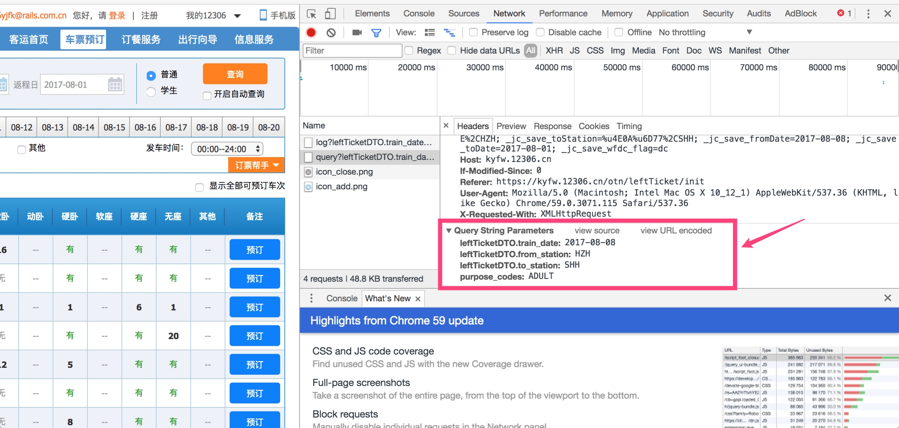
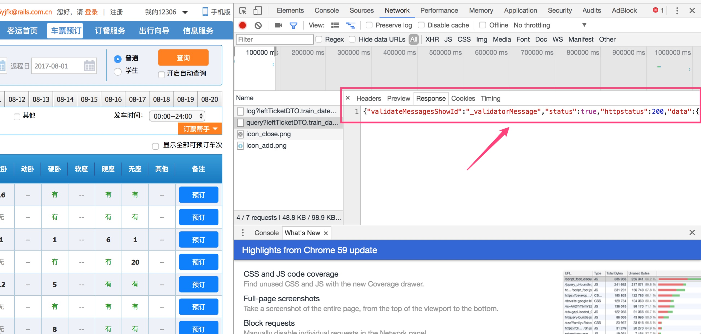
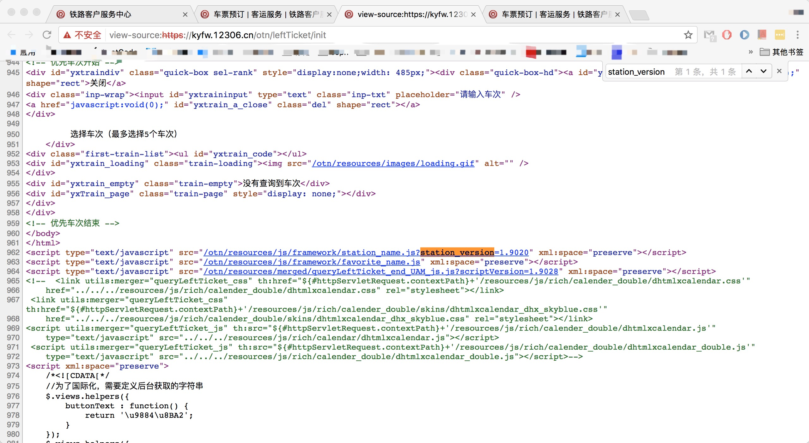
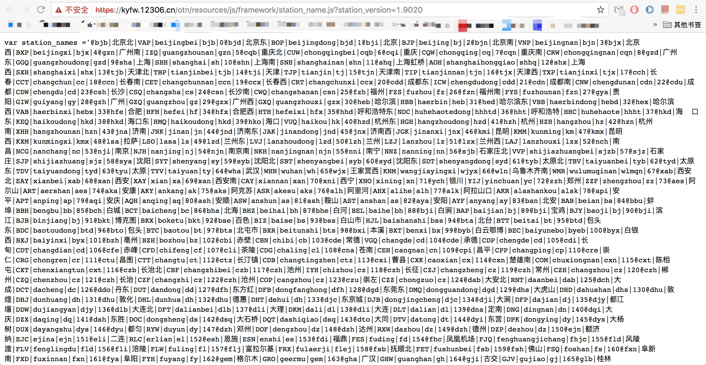
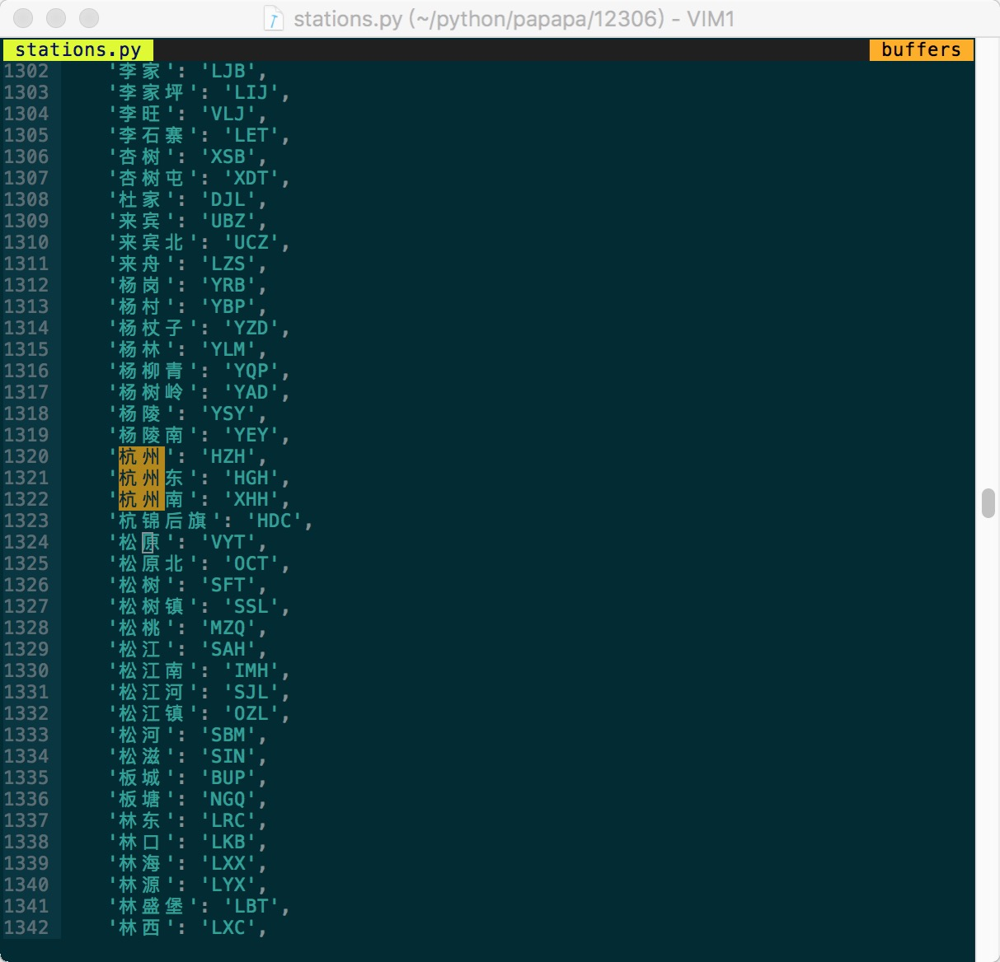
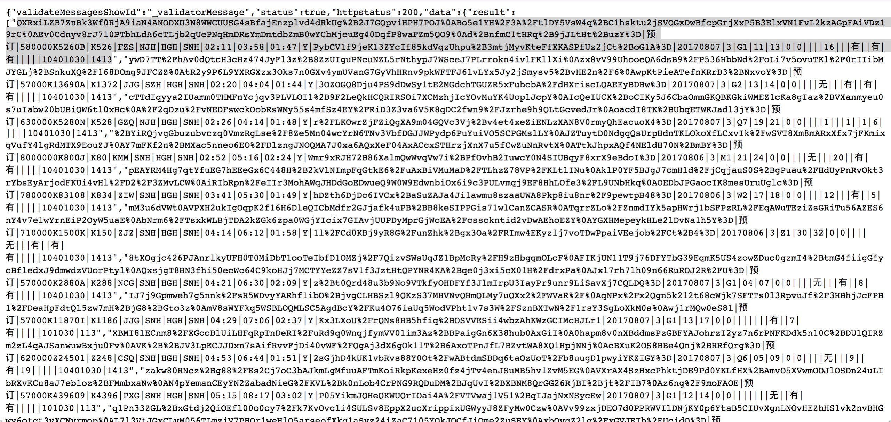
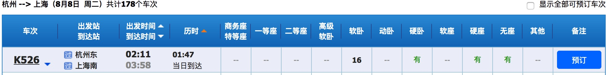

## 火车票查询工具

参考：https://www.shiyanlou.com/courses/623/labs/2072/document

## 解析参数——docopt

Python3 命令行参数解析工具。

安装

```
pip3 install docopt
```

Python有很多写命令行参数解析工具，如 `argparse`, `docopt`, `click`，这里我们选用的是 `docopt` 这个简单易用的工具。`docopt` 可以按我们在文档字符串中定义的格式来解析参数，比如我们在 `tickets.py` 中写下下面的内容

```
# coding: utf-8

"""命令行火车票查看器

Usage:
    tickets [-gdtkz] <from> <to> <date>

Options:
    -h,--help   显示帮助菜单
    -g          高铁
    -d          动车
    -t          特快
    -k          快速
    -z          直达

Example:
    tickets 北京 上海 2016-10-10
    tickets -dg 成都 南京 2016-10-10
"""
from docopt import docopt

def cli():
    """command-line interface"""
    arguments = docopt(__doc__)
    print(arguments)

if __name__ == '__main__':
    cli()
```

解析参数结果

```
▶ python3 tickets.py -dg 杭州 上海 2017-08-08
{'-d': True,
 '-g': True,
 '-k': False,
 '-t': False,
 '-z': False,
 '<date>': '2017-08-08',
 '<from>': '杭州',
 '<to>': '上海'}
```

> 注意，日期月和日都是两位数，不要写成 2017-8-8，在解析 json 的时候会出错。

## 获取数据

mac上查看chrome浏览器快捷键

```
⌘-Option-U		// 打开当前网页的源代码。
⌘-Option-I		// 打开“开发人员工具”。
⌘-Option-J		// 打开“JavaScript 控制台”。
```
查询结果


打开开发者工具，查看请求参数和响应值

请求参数



响应



响应数据是json格式，很长。

只需要利用这个接口， 构建请求URL然后解析返回的JSON数据就可以了。

但是URL里面参数 `from_station` 和 `to_station` 并不是汉字，而是一个代号，如何通过输入汉字获取代号呢？

打开网页源码



点开文件 `station_name.js?station_version=1.9020` 的链接，如下：



利用正则表达式，写一个python脚本将想要的信息提取出来，以字典的形式返回所有车站和大写字母代号，结果如下



同时为字典加名字 stations


返回的数据 json 格式信息



提取其中的一个数据，拆分数据格式，如下

```
QXRxiLZB7ZnBk3Wf0RjA9iaN4ANODXU3N8WWCUUSG4sBfajEnzplvd4dRkUg%2B2J7GQpviHPH7POJ%0ABo5e1YH%2F3A%2FtlDY5VsW4q%2BC1hsktu2jSVQGxDwBfcpGrjXxP5B3ElxVN1FvL2kzAGpFAiVDz19rC%0AEv0Cdnyv8rJ710PTbhLdA6cTLjb2qUePNqHmDRsYmDmtdbZmB0wYCbMjeuEg40DqfP8waFZm5QO9%0Ad%2BnfmC1tHRq%2B9jJLtHt%2BuzY%3D|
预订|
580000K5260B|
K526|
FZS|
NJH|
HGH|
SNH|
02:11|
03:58|
01:47|
Y|
PybCV1f9jeK13ZYcIf85kdVqzUhpu%2B3mtjMyvKteFfXKASPfUz2jCt%2BoG1A%3D|
20170807|
3|
G1|
11|
13|
0|
0|
|
|
|
16|
|
|
有|
|
有|
有|
|
|
|
|
10401030|
1413
```

对应的截图是：




暂时木有头绪理。TODO